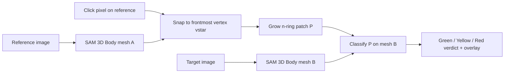

# Skin LOI Estimation

Cross-pose visibility classification for a skin **location of interest (LOI)**.

Pick a point on a **reference** photo of a person, and the app tells you whether
that exact body region is well-viewed, seen side-on, or occluded in a **target**
photo of the same person in a different pose. It renders the region back onto the
target image in three colors:

- **Green** - good, straight-on view
- **Yellow** - partial / side view (surface near-orthogonal to the camera)
- **Red** - occluded (hidden behind other geometry) or back-facing

## How it works



The key idea: **SAM 3D Body outputs a fixed-topology body mesh** (MHR70). Every
image yields vertices with identical count and ordering plus shared faces, so the
anchor vertex and its grown patch index the *same anatomical region* across poses
with no registration step.

Per patch vertex (camera at the origin in the render frame):

- **Facing angle** `cos(theta) = -(normal . viewing_ray)` - +1 faces the camera,
  ~0 is grazing, < 0 points away.
- **Self-occlusion** - cast a ray from the camera through the vertex; if a nearer
  surface is hit, the vertex is hidden.

Labels use two angular bands on the facing cosine (defaults in
[`src/skin_loi/config.py`](src/skin_loi/config.py), tunable via CLI / UI):

- `GREEN` - visible and straight-on (`cos >= green_cos`)
- `YELLOW` - visible but side/partial (`side_cos <= cos < green_cos`)
- `RED` - occluded, back-facing, or too edge-on (`cos < side_cos`)

A region verdict aggregates the patch (visible fraction + green fraction).

## Setup

1. Install SAM 3D Body and its dependencies per [`sam3d/INSTALL.md`](sam3d/INSTALL.md),
   including PyTorch and Hugging Face access to `facebook/sam-3d-body-dinov3`.
2. Install the demo extras:

```bash
pip install -r requirements.txt
```

## Run

```bash
python app.py
```

Then open http://localhost:7860. Optionally set the device:

```bash
SKIN_LOI_DEVICE=cuda python app.py   # or cpu
```

### Using the app

1. Upload a **reference** and a **target** image, click **Extract meshes**.
2. Click a point on the reference image to pick the LOI; the snapped region is
   previewed.
3. The target pose shows the colored region overlay and a verdict badge. Tune the
   **Thresholds** (grazing cosine, region rings, anchor radius) to recompute live.

## Project layout

```
app.py                     # Gradio web app
src/skin_loi/
  config.py                # model id, colors, thresholds
  mesh_extraction.py       # MeshResult + extract_mesh()
  projection.py            # project(), pixel_to_vertex()
  region.py                # n_ring() patch growing
  visibility.py            # 3-way classifier + region verdict
  overlay.py               # colored overlays + verdict badge HTML
  pipeline.py              # LOIPipeline orchestrator (loads estimator once)
tests/test_visibility.py   # classifier threshold tests
test_loi_extraction.ipynb  # original exploration notebook (reference)
```
